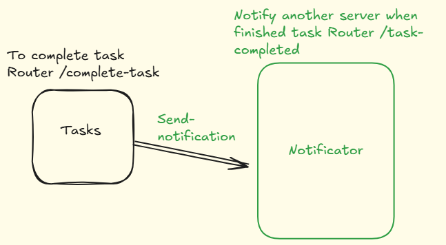

# Servidor-webhooks-node
Webhooks são uma forma de permitir que um aplicativo envie informações em tempo real para outro aplicativo. Imagine que você tenha um sistema que precisa ser notificado sempre que algo acontece em outro sistema.
